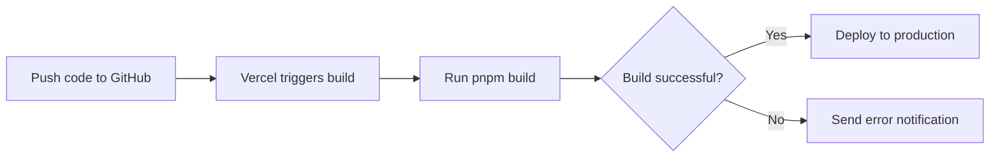

# Vercel Deployment Guide

## Deployment Status Assessment

✅ **Current GitHub repository is ready for Vercel deployment**

### Checklist Results

| Check Item | Status | Notes |
|------------|--------|-------|
| package.json scripts | ✅ Pass | Includes dev, build, start scripts |
| Package Manager | ✅ Pass | Uses pnpm, natively supported by Vercel |
| Environment Variables | ✅ Pass | Contract addresses hardcoded, no additional config needed |
| Next.js Version | ✅ Pass | Next.js 16, natively supported by Vercel |
| Sensitive Information | ✅ Pass | No sensitive data leakage risk |
| .gitignore | ✅ Pass | .env files excluded |

---

## Deployment Steps

### Method 1: Deploy via Vercel Web Interface (Recommended)

#### 1. Login to Vercel
- Visit: https://vercel.com
- Login with your GitHub account

#### 2. Import Project
- Click "Add New" → "Project"
- Select `Fillped-Idealist/Blitz-Arena` from Import Git Repository
- Click "Import"

#### 3. Configure Project
- **Project Name**: `blitz-arena` (or custom)
- **Framework Preset**: `Next.js` (auto-detected)
- **Root Directory**: `./` (keep default)
- **Build Command**: `pnpm build` (auto-configured)
- **Output Directory**: `.next` (auto)
- **Install Command**: `pnpm install` (auto-configured)

#### 4. Environment Variables
This project **does not require** environment variables because:
- Contract addresses are hardcoded in `src/lib/chainConfig.ts`
- No API keys or database configuration needed

#### 5. Deployment Settings
- **Region**: Select `Hong Kong` (hkg1) for optimal Asian region access speed
- **Node.js Version**: Keep default (recommended 18.x or higher)
- **Enable CI/CD**: ✅ Keep enabled

#### 6. Start Deployment
Click "Deploy" button and wait for deployment to complete (usually 2-3 minutes)

---

### Method 2: Deploy via Vercel CLI

#### 1. Install Vercel CLI
```bash
npm i -g vercel
```

#### 2. Login
```bash
vercel login
```

#### 3. Deploy
```bash
cd /workspace/projects
vercel
```

Follow the prompts and select:
- Link to existing project? `No`
- Scope: Your GitHub account
- Project name: `blitz-arena`
- Framework: `Next.js`
- Deploy to: `Production`

---

## Post-Deployment Configuration

### 1. Add Custom Domain (Optional)
- In Vercel project settings, click "Domains"
- Add custom domain, e.g., `blitz-arena.com`
- Configure DNS records following the prompts

### 2. Configure Environment Variables (If Needed)
If you need to add environment variables later:
- Go to project settings → Environment Variables
- Add variable name and value
- Redeploy the project

### 3. Set Up Branch Protection (Recommended)
In GitHub repository settings:
- Settings → Branches
- Enable "Branch protection rule" for main
- Require "Require status checks to pass before merging"

---

## Verify Deployment

### Checklist
- [ ] Website is accessible
- [ ] Wallet connection works properly
- [ ] Can connect to Mantle Sepolia testnet
- [ ] Smart contract interactions work
- [ ] All pages load correctly
- [ ] Mobile responsive layout works

### Common Issues Troubleshooting

#### Issue 1: Deployment Failed - Build Error
**Solution**:
```bash
# Test build locally
pnpm build

# Check TypeScript errors
npx tsc --noEmit
```

#### Issue 2: Smart Contract Connection Failed
**Solution**:
- Check browser console for network requests
- Verify Mantle Sepolia testnet RPC is working
- Verify contract addresses are correct

#### Issue 3: Styles Not Loading
**Solution**:
- Clear Vercel cache: Project Settings → Git → Clear Cache
- Redeploy the project

---

## Continuous Integration/Continuous Deployment (CI/CD)

Vercel has automatically configured CI/CD:
- **Trigger**: Push to main branch
- **Auto-build**: Every push triggers build
- **Auto-deploy**: Successful builds deploy automatically
- **Preview Environments**: Each PR generates preview link

### Workflow


---

## Performance Optimization Suggestions

### 1. Enable ISR (Incremental Static Regeneration)
For pages with dynamic data, use:
```typescript
export const revalidate = 3600; // 1 hour
```

### 2. Enable Image Optimization
Use Next.js Image component:
```typescript
import Image from 'next/image';
```

### 3. Configure CDN
Vercel automatically configures global CDN, no additional setup needed.

---

## Cost Analysis

### Vercel Free Plan
- ✅ Unlimited deployments
- ✅ 100GB bandwidth/month
- ✅ 6,000 build minutes/month
- ✅ Custom domain support
- ✅ Automatic HTTPS

### Use Cases
Blitz Arena project fully meets Vercel free plan requirements, no additional payment needed.

---

## Security Recommendations

### 1. Update Dependencies Regularly
```bash
pnpm update
```

### 2. Enable Security Headers
Add in `next.config.ts`:
```typescript
const nextConfig: NextConfig = {
  async headers() {
    return [
      {
        source: '/:path*',
        headers: [
          {
            key: 'X-DNS-Prefetch-Control',
            value: 'on'
          },
          {
            key: 'Strict-Transport-Security',
            value: 'max-age=63072000; includeSubDomains; preload'
          }
        ]
      }
    ];
  }
};
```

### 3. Monitor Logs
Check in Vercel dashboard:
- Function logs
- Build logs
- Error tracking

---

## Monitoring and Analytics

### Vercel Analytics
- Enable "Web Analytics" in project settings
- View metrics like visits, page performance

### Error Tracking
Recommended to integrate Sentry (optional):
```bash
pnpm add @sentry/nextjs
```

---

## Rollback Plan

If issues occur with new version:
1. Go to Vercel project → Deployments
2. Find the previous stable version
3. Click "..." → "Promote to Production"

---

## Related Links

- Vercel Docs: https://vercel.com/docs
- Next.js Deployment Guide: https://nextjs.org/docs/deployment
- Mantle Sepolia Testnet: https://sepolia.mantle.xyz/

---

## Technical Support

If you encounter deployment issues:
1. Check Vercel build logs
2. View GitHub Actions (if available)
3. Visit Vercel Community Forum

---

**After deployment, you will get a URL like:**
```
https://blitz-arena.vercel.app
```

Or custom domain:
```
https://blitz-arena.com
```
